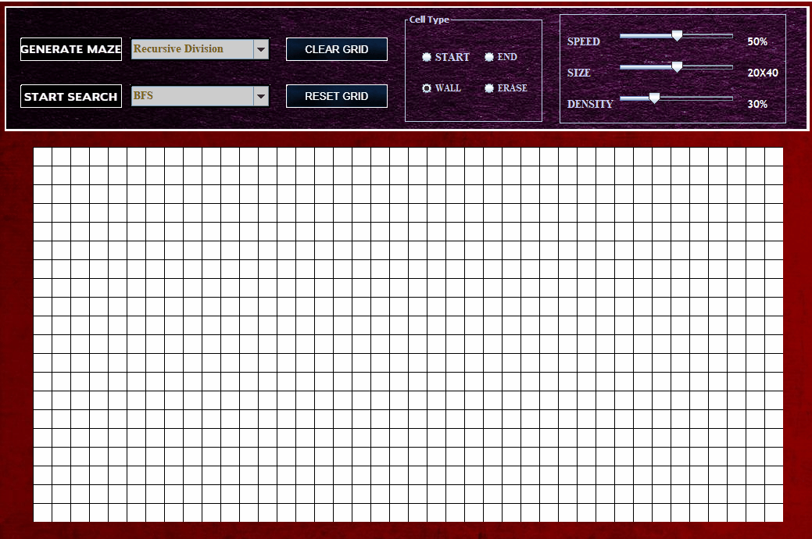

# PathFindingVisualization
Project to visualize how PathFinding Algorithm works and to implement various Maze Generation Algorithm.

**Small Demo of Live Project is shown below........ To see more Features Please Explore the GIF Directory**

**1.) Bfs and A-Star Comparison**

**2.) Generation of Recursive Maze**

**3.) Generation of BFS-Random Maze**

**4.) Changing Size of Grid**

